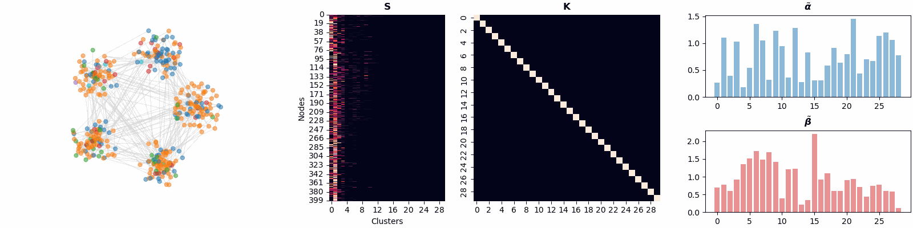

# Bayesian Nonparametric Graph Pooling

This repository contains the code for the reproducibility of the experiments presented in the paper [BN-Pool: a Bayesian Nonparametric Approach for Graph Pooling](). 


## ⚡ TL;DR

BNPool is a layer for GNN architectures for graph classification and node clustering.
BNPool leverages a Bayesian non-parametric approach to dynamically group nodes based on their features, the graph connectivity, and the downstram task at hand **without** pre-specifying the number of clusters beforehand.
Differently from existing graph pooling approach based on node clustering, BNPool can learn a different number of clusters for each input graph.

<p align=center>
	
</p>


## ⚙️ Setup

To install the required packages, create a conda environment using the provided environment file:

```bash
conda env create -f environment.yml
conda activate bnpool
```

So far, the environment has been tested on:
- Linux (Ubuntu >= 20.0)
- Windows 11 (Versione 10.0.26100)

## ⏱ Quick start

The file [minimal_example.py](./minimal_example.py) is a self-contained script that showcases:

- Integration with PyTorch Geometric.
- How to build a simple GNN for graph classification that uses BN-Pool.
- Training and evaluation on a sample dataset.

To run the file execute:

```bash
python minimal_example.py
```

## 🧪 Experiments

BN-Pool can be used within GNNs for node clustering and graph classification.

To reproduce the node clustering experiment run:

```bash
python run_clustering.py
```

To reproduce the graph classification experiment run:

```bash
python run_classification.py
```

### 📝 Config files

Each script uses [Hydra](https://hydra.cc/) for configuration management. 
The corresponding YAML config files can be found in the `config` directory. 
You can override any configuration parameter from the CLI, for example:

```bash
python run_classification.py dataset=bench-hard pooler=mincut epochs=100 optimizer.hparams.lr=1e-4
```

will launch the graph classification script on the `enzymes` dataset, using a GNN configured with the `mincut` layer, trained only for `100` epochs, using a learning rate of `1e-4` in the optimizer.

To test the execution of all the available pooling methods and datasets for node clustering launch the command:

```bash
python run_clustering.py --config-name=test_clustering -m
```

To do the same for graph clustering launch the command:

```bash
python run_classification.py --config-name=test_classification -m
```

> [!Warning]
> This might take some time and a few datasets require a GPU with more than 24GB of VRAM.

## 📂 Project structure

This repository is structured as follows:

```
./
├── config/                     # Hydra configuration files
├── source/                     # Directory with the scripts
│   ├── data/                   # Dataset handling scripts
│   ├── layers/                 # Neural network layers
│   │   ├── edgepool/           # EdgePool implementation
│   │   ├── kmis/               # KMIS implementation
│   │   ├── just_balance.py     # JBGNN implementation
│   │   ├── sum_pool.py         # A simple node aggregator
│   │   └── bnpool.py           # BN-Pool implementation
│   ├── models/                 # GNN architectures (torch models)
│   ├── pl_modules/             # PyTorch Lightning modules
│   └── utils/                  # Utility functions
├── minimal_example.py          # Quick start example
├── run_classification.py       # Graph classification runner
├── run_clustering.py           # Node clustering runner
├── environment.yml             # Conda environment specification
├── README.md                   # This README file
└── LICENSE                     # MIT License

```

- The file `layers/bnpool.py` provides the implementation of the BN-Pool layer. 

- The folder `layers/` also contains the implementation of other layers not available in PyG.

- The folder `/models` contains the GNN architectures for node classification and clustering. These are torch models.

- The folder `/pl_modules` contain the different Lighnting modules that handle training and logging of the different models.

- The folder `/data` contains all the script for dowloading and processing the datasets.

- The folder `/utils` contains several utilities functions used for training, processing data, handling config files, or logging.

## 📦 Datasets

All datasets are automatically downloaded and stored in the folder `data`.

The datasets used in the experiments are:
- Several [TUDatasets](https://chrsmrrs.github.io/datasets/).
- The dataset `molhiv` from [OGB](https://ogb.stanford.edu/docs/graphprop/).
- The `community` graph built uisng [PyGSP](https://pygsp.readthedocs.io/en/stable/).
- The `bench-hard` dataset from [GCB](https://github.com/FilippoMB/Benchmark_dataset_for_graph_classification).


## 📚  Bibtex reference

If you find this code useful please consider to cite our paper:

```bibtex
@misc{castellana2025bnpool,
      title={BN-Pool: a Bayesian Nonparametric Approach for Graph Pooling}, 
      author={Daniele Castellana and Filippo Maria Bianchi},
      year={2025},
      eprint={},
      archivePrefix={arXiv},
      primaryClass={cs.LG},
      url={}, 
}
```