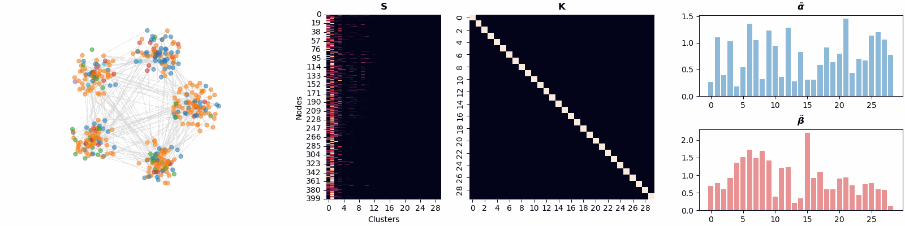

# Bayesian Nonparametric Graph Pooling

[](https://openreview.net/forum?id=3B3Zr2xfkf)
[](https://arxiv.org/abs/2501.09821)
[![tgp](https://img.shields.io/badge/-tgp-5F6367?logo=data%3Aimage%2Fsvg%2Bxml%3Bbase64%2CPD94bWwgdmVyc2lvbj0iMS4wIiBlbmNvZGluZz0idXRmLTgiPz48c3ZnIHdpZHRoPSI4MDBweCIgaGVpZ2h0PSI4MDBweCIgdmlld0JveD0iMCAwIDEyOCAxMjgiIHhtbG5zPSJodHRwOi8vd3d3LnczLm9yZy8yMDAwL3N2ZyIgeG1sbnM6eGxpbms9Imh0dHA6Ly93d3cudzMub3JnLzE5OTkveGxpbmsiIGFyaWEtaGlkZGVuPSJ0cnVlIiByb2xlPSJpbWciIGNsYXNzPSJpY29uaWZ5IGljb25pZnktLW5vdG8iIHByZXNlcnZlQXNwZWN0UmF0aW89InhNaWRZTWlkIG1lZXQiPjxwYXRoIGQ9Ik0xMTEuNiAxMDMuNTRjMTAuMjYtMTIuMTMgMTkuMDItMzMuOTIgOS45Ny01OC45NGMtNC40MS0xMi4xOC05LjM5LTE4Ljk4LTE1LjE5LTIzLjNjLTMuNTMtMi42My0xNy42My05LjI1LTM2LjMtNi4zNmMtMTMuNjUgMi4xMi0zMS44OCAxMC43My00My43MyAyNC43NEMxNC44NiA1My4yOSA1Ljk5IDY0LjA0IDUuNTggNzQuNDhjLS41MyAxMy40MyA5LjU5IDI0Ljk3IDEwLjgyIDI2Ljg0YzIuMTkgMy4zMiAxNy4xMyAyMi4zIDQ1LjIgMjMuMjdjMjQuNzguODUgNDAuOTItMTAuMzEgNTAtMjEuMDV6IiBmaWxsPSIjNDAzZDNlIj48L3BhdGg%2BPHBhdGggZD0iTTI4LjQzIDEzLjlDMTUuNSAyMy4xMy45NyA0Mi4wMSAzLjU4IDY4LjQ5YzEuMjcgMTIuODkgNC40NCAyMC43MSA4Ljk5IDI2LjMyYzIuNzcgMy40MiAxNC43OSAxMy41OSAzMy42MiAxNS4wOWMxOC45OCAxLjUxIDMzLjQxLTIuNzQgNDguNDgtMTMuMjJjMzAuNjMtMjEuMzEgMjYuMTItNTMuNTMgMjQuODEtNTcuMjhTMTA4LjM2IDEzLjU3IDgxLjM5IDUuNzJjLTIzLjgtNi45Mi00MS41MiAwLTUyLjk2IDguMTh6IiBmaWxsPSIjNWU2MzY3Ij48L3BhdGg%2BPHBhdGggZD0iTTUxLjE1IDE1LjY5Yy0xNC4yMS0uNTEtMjcuNzkgMTAuNjItMjkuMSAyNC4zNmMtMS4zMSAxMy43MyA3LjE5IDI0LjE5IDIwLjQzIDI2LjMyYzEzLjI0IDIuMTIgMjguNTUtNS45MiAzMS42My0yMi43NmMzLjE4LTE3LjM1LTkuMzktMjcuNDMtMjIuOTYtMjcuOTJ6IiBmaWxsPSIjZmZmZmZmIj48L3BhdGg%2BPHBhdGggZD0iTTU1LjU0IDM5LjIxczMuNDItLjcxIDQuMS01Ljc1Yy42Ny00Ljk2LTEuNzktOS4xOS03LjUzLTEwLjcxYy02LjI0LTEuNjUtMTAuNDcgMS43OC0xMS41NyA1LjM5Yy0xLjUzIDUuMDIuNzMgNy40MS43MyA3LjQxcy02LjEyIDEuNDctNi42MSA4LjY5Yy0uNDYgNi44MSA0LjE5IDEwLjQ3IDguODYgMTEuNTljNS43NyAxLjM5IDEyLjMxLS4xOSAxMy45MS03LjU1YzEuMzMtNi4wNi0xLjg5LTkuMDctMS44OS05LjA3eiIgZmlsbD0iIzMwMzAzMCI%2BPC9wYXRoPjxwYXRoIGQ9Ik00NS45MiAzMC4wM2MtLjU1IDIuMDcuNTUgNC4wNyAyLjcxIDQuNjJjMi4zMy41OSA0LjQ1LS4xOCA1LjAyLTIuNTZjLjUtMi4xMS0uNS0zLjk3LTIuOTYtNC41N2MtMi4wMi0uNS00LjE3LjI1LTQuNzcgMi41MXoiIGZpbGw9IiNmZmZmZmYiPjwvcGF0aD48cGF0aCBkPSJNNDcuNjggNDAuMzJjLTIuNjItLjgxLTYuMDguMi02LjYzIDMuNzJjLS41NSAzLjUyIDEuNTYgNS4zMiA0LjMyIDUuODJjMi43Ni41IDUuMzctLjk1IDUuODgtMy43N2MuNS0yLjgxLS45Ni00Ljk3LTMuNTctNS43N3oiIGZpbGw9IiNmZmZmZmYiPjwvcGF0aD48L3N2Zz4%3D&labelColor=5548B0)](https://github.com/tgp-team/torch-geometric-pool)

This is a lightweight codebase to reproduce the experiments in the paper [BNPool: Bayesian Nonparametric Pooling for Graph Neural Networks](https://openreview.net/forum?id=3B3Zr2xfkf) by [Daniele Castellana](https://danielecastellana22.github.io/) and [Filippo Maria Bianchi](https://sites.google.com/view/filippombianchi/home).
This repository uses [`torch-geometric-pool (tgp)`](https://github.com/tgp-team/torch-geometric-pool) directly for all pooling layers, including the official [BN-Pool](https://torch-geometric-pool.readthedocs.io/en/latest/api/poolers.html#tgp.poolers.BNPool) implementation.


## BNPool

BNPool is a hierarchical graph pooling layer for graph classification that can also be used for node clustering.
It uses a Bayesian non-parametric formulation to adapt the number of clusters to each graph instead of fixing it in advance.



## 🛠️ Setup

### Conda

Create the environment from the provided file:

```bash
conda env create -f environment.yml
conda activate bnpool
```

The checked-in [`environment.yml`](./environment.yml) is configured for Linux + NVIDIA CUDA.
If you want a CPU/MPS-only Conda environment instead, comment out the two lines marked in [`environment.yml`](./environment.yml).

### uv

Create and sync the environment with:

```bash
uv sync
```

If `uv` cannot find a compatible local Python, install one explicitly and retry:

```bash
uv python install 3.12
uv sync
```

Then either activate the virtual environment:

```bash
source .venv/bin/activate
```

or run commands directly through `uv`:

```bash
uv run python minimal_example.py
uv run python run_classification.py
uv run python run_clustering.py
```

## ⚡️ Quick start

The file [`minimal_example.py`](./minimal_example.py) is a minimal end-to-end example that:

- loads `MUTAG`
- imports `BNPool` directly from `tgp`
- trains a small graph-classification model

Run it with:

```bash
python minimal_example.py
```

## 🧪 Experiments

### Graph classification

Run the default graph-classification configuration:

```bash
python run_classification.py
```

This uses Hydra and defaults to `dataset=mutag`.

Example override:

```bash
python run_classification.py dataset=bench-hard pooler=mincut epochs=100 optimizer.hparams.lr=1e-4
```

### Node clustering

Run the default node-clustering configuration:

```bash
python run_clustering.py
```

This defaults to `dataset=community`.

### Smoke-test configs

Short validation runs for the available setups are provided through:

```bash
python run_classification.py --config-name test_classification -m
python run_clustering.py --config-name test_clustering -m
```

> [!Warning]
> This might take some time and a few datasets require a GPU with more than 24GB of VRAM.

## 📂 Project structure

```text
.
├── config/                 # Hydra configs
├── source/
│   ├── data/               # Dataset loading and preprocessing
│   ├── models/             # Model definitions using tgp poolers
│   ├── pl_modules/         # PyTorch Lightning training modules
│   └── utils/              # Hydra, metrics, and training utilities
├── minimal_example.py      # Small BNPool example with tgp
├── run_classification.py   # Graph-classification runner
├── run_clustering.py       # Node-clustering runner
├── environment.yml         # Conda environment
└── LICENSE
```

## 📚 Citation

If you use this code, please cite:

```bibtex
@article{castellana2026bnpool,
  title={BNPool: Bayesian Nonparametric Pooling for Graph Neural Networks},
  author={Castellana, Daniele and Bianchi, Filippo Maria},
  journal={Transactions on Machine Learning Research},
  year={2026},
  url={https://openreview.net/forum?id=3B3Zr2xfkf}
}
```

## 🔐 License

This project is licensed under the MIT License. See [LICENSE](./LICENSE).
